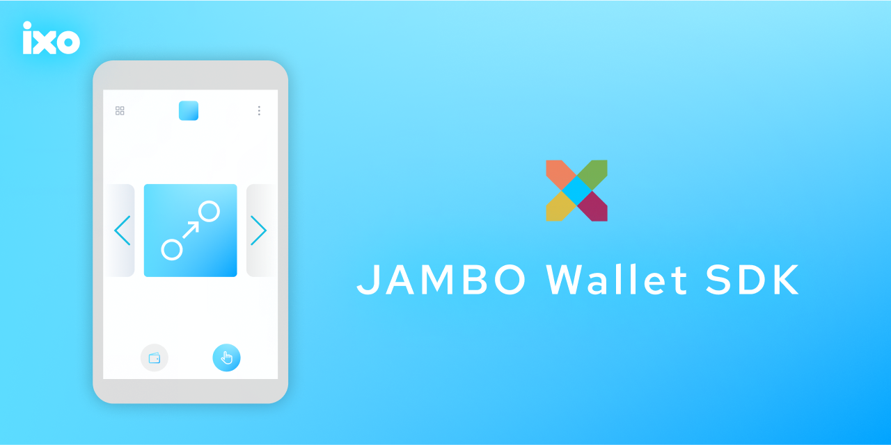

# JAMBO WALLET SDK 💼


<p align="center">
  
</p>

<br />

<h2 align="center">
    An SDK to easily access the Opera mobile wallet for JAMBO dapps
</h2>

<br />

This repo and product is intentionally managed as Open Source and we aim to use this guide to light our way https://opensource.guide/.
Let us know how we are doing!

## 🔨 Install

```sh
npm install @ixo/jambo-wallet-sdk

yarn add  @ixo/jambo-wallet-sdk
```

## 💻 Usage

This SDK interacts with the Opera mobile wallet and exposes new functions that'll make interaction with the wallet easier, and these exposed functions mimic the same structure as the Keplr browser extension wallet.

To use the SDK, you can call the `getOpera` function, which returns an object of methods similar to the Keplr wallet if it can access the Opera mobile wallet. Otherwise, it returns undefined.

```js
import { getOpera } from '@ixo/jambo-wallet-sdk';

const operaWallet = await getOpera();

if (operaWallet) {
	// interact with the opera mobile wallet using the SDK
}
```

The `OperaWallet` object returned by `getOpera()` includes the following functions:

### enable

```ts
async enable(chainNameOrId: string, chainNetwork: ChainNetwork = 'mainnet'): Promise<void>
```

Enables a chain with the given chain ID or name-and-network type. If the chain is not yet enabled, it retrieves the chain info via the [@ixo/jambo-chain-sdk](https://www.npmjs.com/package/@ixo/jambo-chain-sdk) from the Cosmos or Keplr chain registries and stores is locally for further usage.

### experimentalSuggestChain

```ts
async experimentalSuggestChain(chainInfo: KeplrChainInfo): Promise<void>
```

Suggests a new or custom chain by providing a chain info object. This is very useful if the chain info cannot be found by the [@ixo/jambo-chain-sdk](https://www.npmjs.com/package/@ixo/jambo-chain-sdk).

### getKey

```ts
async getKey(chainId: string, includeDid: boolean = false): Promise<OperaKey | undefined>
```

Gets the account key for the given chain ID. This key includes the account's name (empty string), the algorithm (secp), pubKey, address, bech32Address and the DID (Decentralized Identifier) if the includeDid flag is set to true.

### getOfflineSigner

```ts
async getOfflineSigner(chainId: string): Promise<OfflineDirectSigner | null>
```

Returns an offline signer for the given chain ID.

### signDirect

```ts
signDirect(signerAddress: string, signDoc: SignDoc): Promise<DirectSignResponse>
```

Signs a transaction with the specified signer address.

## 📱 Example

```ts
// initialize opera with custom chain info
const initializeOpera = async (chainInfo: ChainInfo): Promise<Key | undefined> => {
	try {
		const opera = getOpera();
		if (!opera) return;
		await opera.experimentalSuggestChain(chainInfo);
		await opera.enable(chainInfo.chainId);
		const key = await opera.getKey(chainInfo.chainId);
		return key;
	} catch (error) {
		console.error('Error initializing Opera:: ' + error);
	}
};

// initialize opera using a chain ID
const chainId = 'ixo-5';

const initializeOpera = async (): Promise<Key | undefined> => {
	try {
		const opera = getOpera();
		if (!opera) return;
		await opera.enable(chainId);
		const key = await opera.getKey(chainId);
		return key;
	} catch (error) {
		console.error('Error initializing Opera:: ' + error);
	}
};
```

## 📃 License

This SDK is licensed under the Apache 2 License. See the [LICENSE](/LICENSE) file for more information.
