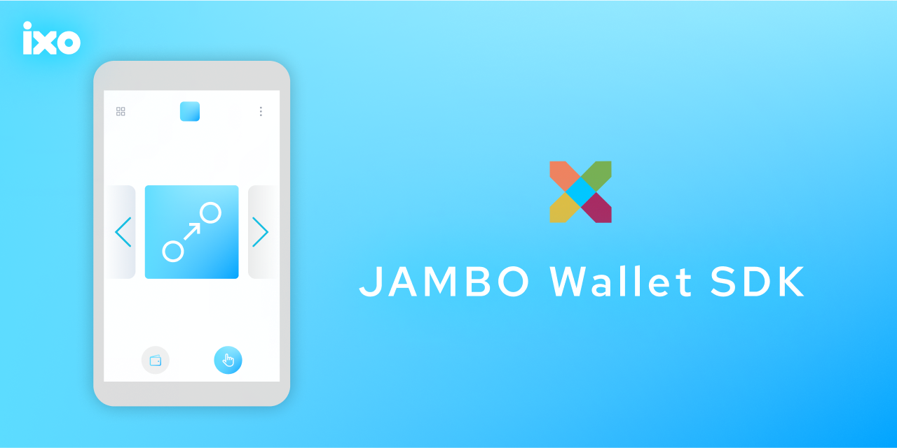

# JAMBO WALLET SDK 💼


<p align="center">
  
</p>

<br />

<h2 align="center">
    An SDK to easily access the Impacts X wallet and Opera mobile wallet for JAMBO dapps
</h2>

<br />

This repo and product is intentionally managed as Open Source and we aim to use this guide to light our way https://opensource.guide/.
Let us know how we are doing!

## 🔨 Install

```sh
npm install @ixo/jambo-wallet-sdk

yarn add  @ixo/jambo-wallet-sdk
```

## 💻 Usage

This SDK interacts with the Impacts X in-app browser wallet and the Opera mobile wallet and exposes new functions that'll make interaction with the wallets easier, and these exposed functions mimic the same structure as the Keplr browser extension wallet.

To use the SDK, you can call the `getImpactsX` or `getOpera` functions, which returns an object of methods similar to the Keplr wallet if those wallets are available. Otherwise, it returns undefined.

## Opera

```js
import { getOpera } from '@ixo/jambo-wallet-sdk';

const operaWallet = await getOpera();

if (operaWallet) {
	// interact with the opera mobile wallet using the SDK
}
```

The `operaWallet` object returned by `getOpera()` includes the following functions:

### enable

```ts
async operaWallet.enable(chainNameOrId: string, chainNetwork: ChainNetwork = 'mainnet'): Promise<void>
```

Enables a chain with the given chain ID or name-and-network type. If the chain is not yet enabled, it retrieves the chain info via the [@ixo/cosmos-chain-resolver](https://www.npmjs.com/package/@ixo/cosmos-chain-resolver) from the Cosmos or Keplr chain registries and stores it locally for further usage.

### experimentalSuggestChain

```ts
async operaWallet.experimentalSuggestChain(chainInfo: KeplrChainInfo): Promise<void>
```

Suggests a new or custom chain by providing a chain info object. This is very useful if the chain info cannot be found by the [@ixo/cosmos-chain-resolver](https://www.npmjs.com/package/@ixo/cosmos-chain-resolver).

### getKey

```ts
async operaWallet.getKey(chainId: string, includeDid: boolean = false): Promise<WalletKey | undefined>
```

Retrieves the account 'key' associated with the provided chain ID. The returned 'key' includes the following fields:

- name: string (an empty string)
- algo: string (secp256k1)
- pubKey: uint8Array
- address: uint8Array
- bech32Address: string
- isNanoLedger: boolean (false)
- isKeystone: boolean (false)

If the `includeDid` flag is set to true, `getKey` also includes the did (Decentralized Identifier) associated with the account key.

Additionally, `getKey` stores the user's data in session storage to be used by the offline signer, so it needs to be called at least once for every session.

To provide a better user experience, we advise against calling `getKey` too frequently. This is because `getKey` requires the user to authenticate via fingerprint scan, facial recognition, or password (depending on the authentication method enabled on their device/opera mobile browser), which may be cumbersome for the user.

### getOfflineSigner

```ts
async operaWallet.getOfflineSigner(chainId: string): Promise<OfflineDirectSigner | null>
```

Returns an offline signer for the given chain ID.

### signDirect

```ts
async operaWallet.signDirect(signerAddress: string, signDoc: SignDoc): Promise<DirectSignResponse>
```

Signs a transaction with the specified signer address.

### **raw** (for advanced developers)

The `__raw__` property exposes the original `interchain` object provided by the OperaWallet on the `window` object. This property is intended for advanced developers who require direct access to the underlying `interchain` object for more complex use cases.

Please note that the OperaWallet's `interchain` object, including the `__raw__` property, is not officially documented (except for [this](https://help.opera.com/en/crypto/opera-wallet-integration-guide/)). Using it directly may lead to unexpected behavior or errors, and should be done only by developers who have a thorough understanding of how it works and why it is necessary for their use case. If you are unsure whether you need to use `__raw__`, we recommend using the aforementioned documented methods and properties instead.

## Impacts X

```js
import { getImpactsX } from '@ixo/jambo-wallet-sdk';

const impactsXWallet = await getImpactsX();

if (impactsXWallet) {
	// interact with the Impacts X in-app mobile wallet using the SDK
}
```

The `impactsXWallet` object returned by `getImpactsX()` includes the following functions:

### enable

```ts
async impactsXWallet.enable(chainNameOrId: string, chainNetwork: ChainNetwork = 'mainnet'): Promise<void>
```

The enable method allows you to activate a specific blockchain chain using either its ID or name-and-network configuration. This functionality currently supports the ixo blockchain only, limited to the chain network active on the mobile app. When utilizing this method, your website's authenticity will also be verified against the ImpactsX whitelist.

It is crucial to call this method before invoking any other `impactsX` methods to ensure they function correctly. The enabling process only needs to occur once per domain until any significant changes to the domain take place. If your site navigates away from the enabled domain, permissions will reset, requiring the enabling process to be repeated.

Please be aware that the ImpactsX whitelist is administered by Ixo and requests for access should be directed to Ixo. This whitelist operates on a subdomain level, meaning that whitelisting a specific domain (e.g., `jambo.earth`) will not cover subdomains (e.g., `my.jambo.earth``). For subdomains to function seamlessly, they must be individually whitelisted (e.g., my.jambo.earth needs its own whitelisting).

It's important to stay updated with any further developments in the impactsX ecosystem as these details may evolve over time.

### experimentalSuggestChain

```ts
async impactsXWallet.experimentalSuggestChain(chainInfo: KeplrChainInfo): Promise<void>
```

Suggests a new or custom chain by providing a chain info object. This is feature is not supported yet and will return error until further development.

### getKey

```ts
async impactsXWallet.getKey(chainId: string, includeDid: boolean = false): Promise<WalletKey | undefined>
```

Retrieves the account 'key' associated with the provided chain ID (supports only the active chain and chainNetwork in the app until further development). The returned 'key' includes the following fields:

- name: string (an empty string)
- algo: string (secp256k1)
- pubKey: uint8Array
- address: uint8Array
- bech32Address: string
- isNanoLedger: boolean (false)
- isKeystone: boolean (false)

If the `includeDid` flag is set to true, `getKey` also includes the did (Decentralized Identifier) associated with the account key.

### getOfflineSigner

```ts
impactsXWallet.getOfflineSigner(chainId: string): OfflineDirectSigner
```

Returns an offline signer for the given chain ID (supports only the active chain and chainNetwork in the app until further development).

### signDirect

```ts
async impactsXWallet.signDirect(signerAddress: string, signDoc: SignDoc): Promise<DirectSignResponse>
```

Signs a transaction with the specified signer address via biometric authentication.

## 📱 Examples

### Opera Example

```ts
const opera = getOpera()

// initialize opera with custom chain info
const initializeOpera = async (chainInfo: ChainInfo): Promise<Key | undefined> => {
	try {
		if (!opera) throw new Error('Opera not available');
		await opera.experimentalSuggestChain(chainInfo);
		await opera.enable(chainInfo.chainId);
		const key = await opera.getKey(chainInfo.chainId);
		return key;
	} catch (error) {
		console.error('Error initializing Opera:: ' + error);
	}
};

// or
// initialize opera using a chain ID
const chainId = 'ixo-5';

const initializeOpera = async (): Promise<Key | undefined> => {
	try {
		if (!opera) throw new Error('Opera not available');
		await opera.enable(chainId);
		const key = await opera.getKey(chainId);
		return key;
	} catch (error) {
		console.error('Error initializing Opera:: ' + error);
	}
};

// sign transaction with offline signer
const key = initializeOpera();

const trx = [{
	typeUrl: '/cosmos.bank.v1beta1.MsgSend'
	value: {
		fromAddress: key.bech32Address,
		toAddress: 'ixo1wnw8t3gc...ezn7xge',
		amount: [{
			denom: 'uixo',
			amount: '1000000'
		}]
	}
}]

const offlineSigner = await opera.getOfflineSigner(chainId);

const signingClient = await createSigningClient(rpcEndpoint, offlineSigner);

// signingClient.signAndBroadcast(signerAddress: string, messages: readonly EncodeObject[], fee: number | StdFee | "auto", memo?: string | undefined)
await signingClient.signAndBroadcast(key.bech32Address, trx, 'auto', undefined);
```

### ImpactsX Example

```ts
const impactsX = getOpera()

// initialize impactsX using a chain ID
const chainId = 'ixo-5';

const initializeImpactsX = async (): Promise<Key | undefined> => {
	try {
		if (!impactsX) throw new Error('ImpactsX not available');
		await impactsX.enable(chainId);
		const key = await impactsX.getKey(chainId);
		return key;
	} catch (error) {
		console.error('Error initializing ImpactsX:: ' + error);
	}
};

// sign transaction with offline signer
const key = initializeImpactsX();

const trx = [{
	typeUrl: '/cosmos.bank.v1beta1.MsgSend'
	value: {
		fromAddress: key.bech32Address,
		toAddress: 'ixo1wnw8t3gc...ezn7xge',
		amount: [{
			denom: 'uixo',
			amount: '1000000'
		}]
	}
}]

const offlineSigner = await impactsX.getOfflineSigner(chainId);

const signingClient = await createSigningClient(rpcEndpoint, offlineSigner);

// signingClient.signAndBroadcast(signerAddress: string, messages: readonly EncodeObject[], fee: number | StdFee | "auto", memo?: string | undefined)
await signingClient.signAndBroadcast(key.bech32Address, trx, 'auto', undefined);
```

## 📃 License

This SDK is licensed under the Apache 2 License. See the [LICENSE](/LICENSE) file for more information.
